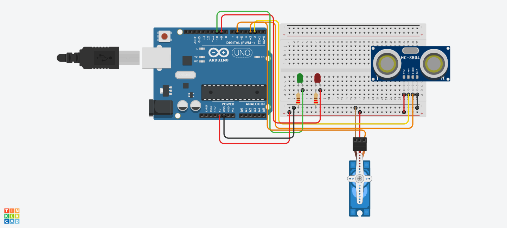
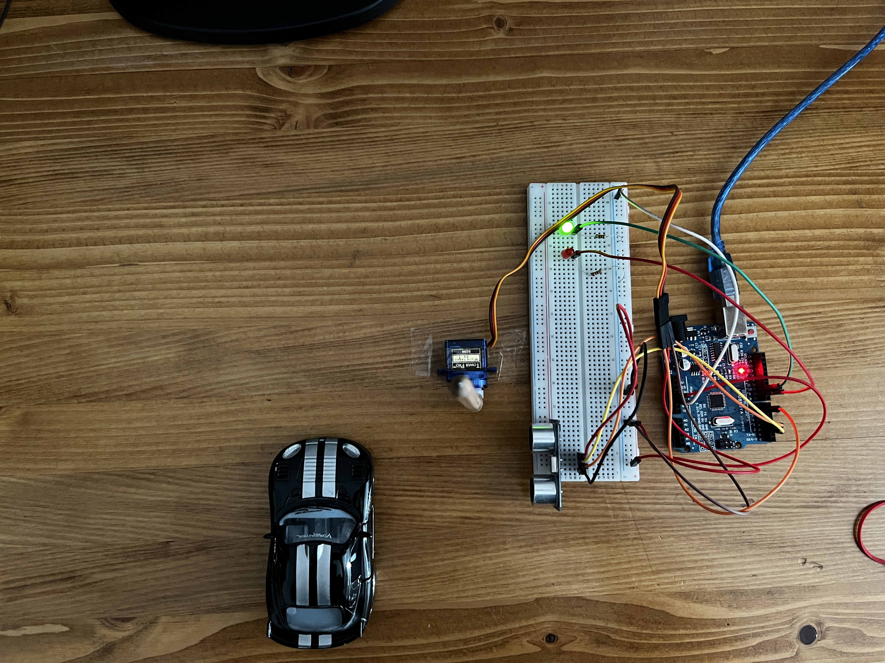
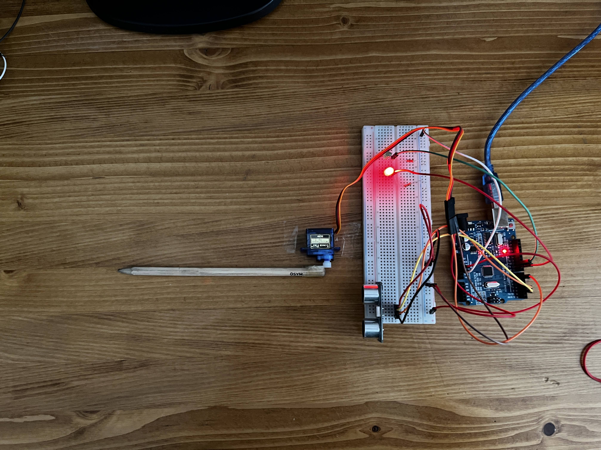

<h1>Akıllı Bariyer</h1>

<strong>Projenin Amacı:</strong> 
Bu proje, **HC-SR04 ultrasonik mesafe sensörü** ve **servo motor** kullanarak yapılan bir akıllı bariyer sistemidir. Sistemin amacı, bariyer önüne yaklaşan aracı algılayarak bariyeri otomatik olarak açmak ve aracın geçişinden sonra bariyeri kapatmaktır.

- **Araç Algılama:** HC-SR04 ultrasonik sensör, bariyer önündeki mesafeyi sürekli ölçer. 
- **Bariyer Kontrolü:** Ölçülen mesafe belirlenen eşik değerinin (örneğin 20 cm) altına düştüğünde servo motor bariyeri kaldırır (bariyer açılır).  
- **Geçiş Sonrası Kapanma:** Araç geçtikten sonra mesafe tekrar eşik değerinin üzerine çıkınca servo motor bariyeri indirir (bariyer kapanır).  
- **LED Göstergeler:** Bariyer durumu yeşil ve kırmızı LED'ler ile görsel olarak belirtilir. Yeşil LED bariyer açıkken, kırmızı LED bariyer kapalıyken yanar.

## Kullanılan Donanımlar

<h2> Kullanılan Bileşenler</h2>
<ul>
  <li>1 x Arduino UNO </li>
  <li>1 x Ultrasonik Mesafe Ölçer(HC-SR04)</li>
  <li>2 x 220Ω Direnç </li>
  <li>2 x LED</li>
  <li>1 x Servo Motor(SG90)</li>
  <li>Jumper kabloları</li>
  <li>Breadboard (devreyi kurmak için)</li>
</ul>

<h2>Devre Simülasyon Linki</h2>

https://www.tinkercad.com/things/ksKfVfCEbvl-akillibariyer?sharecode=-z6SnN9_v7sqwPdiSxnUSrYGtGCsI4Nqv6N4olz03S4

<h3>Devre Şeması</h3>

