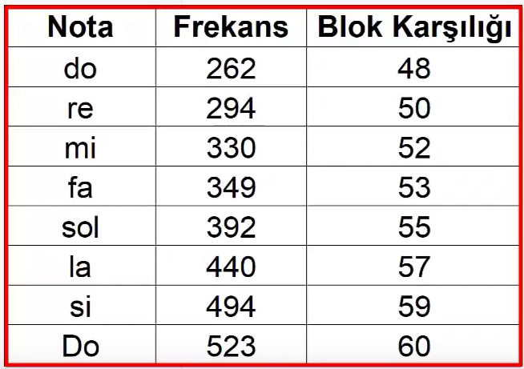
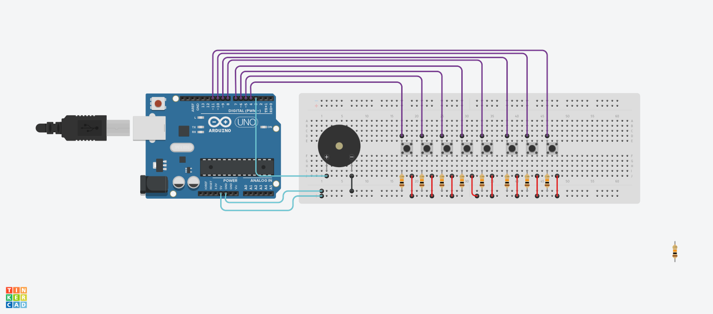

<h1>Pasif Buzzer ile Piyano Tuşları</h1>

<strong>Proje Açıklaması:</strong> 
Geçen Aktif Buzzer projesinde sadece tek bir ses tonunda çaldığını ama pasif buzzer'ın ise ses tonlarını ayarlayabildiğimizi söylemiştik.
Bizde her bir notanın aşağıdaki gibi frekansını alarak <code>tone(Pin,Hertz,Duration)</code> fonksiyonundan frekansını
çalacağı süresini ayarlayabiliyoruz. Bu şekilde her bir notaya karşılık bir buton ayarladık ve piyanomuzu oluşturduk.

<h2>Malzemeler</h2>

- Arduino UNO
- 8 adet basmalı buton
- 8 adet 10kΩ direnç
- 1 aktif Pizeo(Buzzer)
- Jumper kablolar  
- Breadboard  

<h2>Devre Simülasyon Linki</h2>

https://www.tinkercad.com/things/7fhQqzAjphF-buzzerpiano?sharecode=3HG2kGFZhTaT0iaI4S026Pw6JF2IYcONtrZbPHhiLvk

<h3>Devre Şeması ve Düzeneği</h3>

