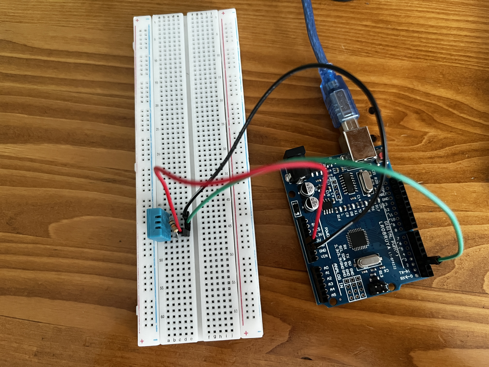

<h1>DHT11 Sensörüyle Ortamın Sıcaklığını ve Nem Değerlerini Ölçme</h1>

<h2>DHT Sensörleri Hakkında</h2>

<h3>DHT11 Nedir?</h3>

  <strong>DHT11</strong> dijital bir sensördür ve ortamın <strong>sıcaklık</strong> ve <strong>nem oranını</strong> ölçmek için kullanılır.
  İçinde bir <em>NTC sıcaklık sensörü</em> (ısıya duyarlı direnç) ve <em>nem algılayıcı</em> kapasitif sensör bulunur.
  DHT11, sıcaklık ve nem değerlerini dijital olarak Arduino’ya iletir.

<h4>DHT11 3 Bacaklı vs. 4 Bacaklı Farkı:</h4>
<ul>
  <li><strong>3 bacaklı modeller</strong> genelde modül halinde gelir. Üzerinde direnç bulunduğundan doğrudan bağlanabilir.</li>
  <li><strong>4 bacaklı modeller</strong> çıplak sensördür. <code>VCC</code> ile <code>DATA</code> arasına <strong>10kΩ'luk pull-up direnci</strong> bağlanmalıdır.</li>
</ul>

<table border="1" cellpadding="6">
  <thead>
    <tr>
      <th>Bacak Sayısı</th>
      <th>Pinler</th>
      <th>Açıklama</th>
    </tr>
  </thead>
  <tbody>
    <tr>
      <td>3 Bacaklı</td>
      <td>VCC, DATA, GND</td>
      <td>Genelde modül. Direnç dahili.</td>
    </tr>
    <tr>
      <td>4 Bacaklı</td>
      <td>VCC, DATA, NC, GND</td>
      <td>NC = Bağlantı yapılmaz. Pull-up direnci gerekir.</td>
    </tr>
  </tbody>
</table>

<h3>DHT22 Nedir?</h3>

  <strong>DHT22</strong> (veya AM2302), DHT11'e benzer şekilde çalışır ama <strong>daha hassas</strong> ve <strong>daha geniş ölçüm aralığına</strong> sahiptir.
  Yine sıcaklık ve nem ölçümü yapar ama verileri daha doğru verir.

<h4>DHT11 vs. DHT22 Karşılaştırması</h4>
<table border="1" cellpadding="6">
  <thead>
    <tr>
      <th>Özellik</th>
      <th>DHT11</th>
      <th>DHT22</th>
    </tr>
  </thead>
  <tbody>
    <tr>
      <td>Sıcaklık Aralığı</td>
      <td>0°C - 50°C</td>
      <td>-40°C - 80°C</td>
    </tr>
    <tr>
      <td>Nem Aralığı</td>
      <td>20% - 90%</td>
      <td>0% - 100%</td>
    </tr>
    <tr>
      <td>Hassasiyet (Sıcaklık)</td>
      <td>±2°C</td>
      <td>±0.5°C</td>
    </tr>
    <tr>
      <td>Hassasiyet (Nem)</td>
      <td>±5%</td>
      <td>±2-3%</td>
    </tr>
    <tr>
      <td>Veri Okuma Hızı</td>
      <td>1 saniyede 1 kez</td>
      <td>2 saniyede 1 kez</td>
    </tr>
    <tr>
      <td>Fiyat</td>
      <td>Ucuz</td>
      <td>Daha pahalı</td>
    </tr>
  </tbody>
</table>

<h3>Nasıl Çalışır?</h3>

  DHT sensörleri, sıcaklık ve nemi algılayıp bu bilgileri tek hat üzerinden <strong>dijital sinyal</strong olarak Arduino’ya iletir.
  Arduino bu verileri çözümleyerek bizim kullanabileceğimiz sıcaklık ve nem değerlerini verir.

  Sensör veri göndermeye hazır hale geldikten sonra Arduino, sensöre bir "başlatma sinyali" gönderir.
  Ardından sensör verileri 40 bitlik bir dijital paket olarak yollar:

<ul>
  <li>16 bit nem verisi</li>
  <li>16 bit sıcaklık verisi</li>
  <li>8 bit checksum (doğrulama için)</li>
</ul>

<h2>Donanım Bileşenleri</h2>
<ul>
  <li>1 x Arduino UNO</li>
  <li>1 x DHT11 (4 bacaklı veya 3 bacaklı)</li>
  <li>1 x 10kΩ direnç (DHT11(4 bacaklı) için pull-down bağlantısı)</li>
  <li>Jumper kablolar</li>
  <li>Breadboard</li>
</ul>

<h2>Devre Görselleri</h2>

<em>Şekil 1: <strong>DHT Devre Şeması</strong> ekranı</em>

