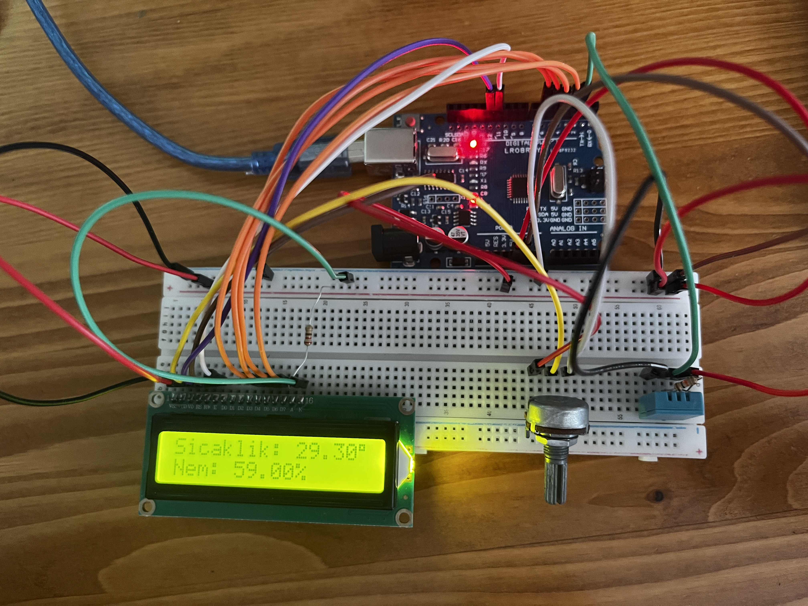
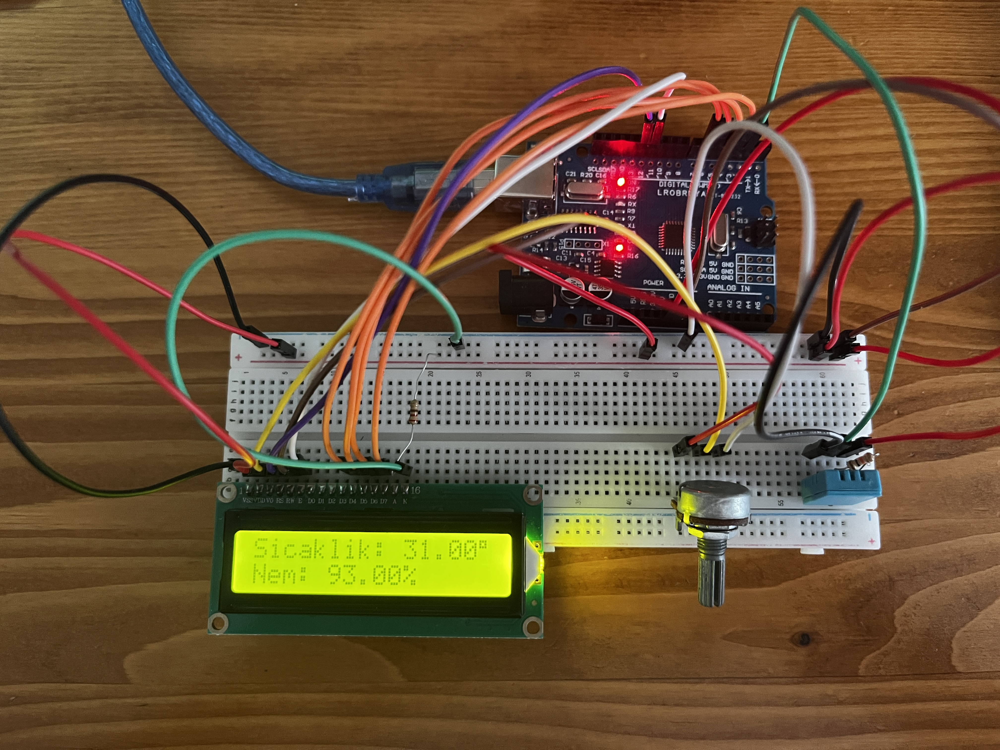

<h1>DHT11 Sensöründen Alınan Sıcaklık ve Nem Verilerinin LCD Ekranda Gösterimi</h1>

<h2>Kısa Açıklama</h2>

Bu projede, ortam sıcaklığı ve nem değerlerini ölçmek için DHT11 sensörü kullanılmıştır. Ölçülen veriler, 16x2 LCD ekran aracılığıyla anlık olarak kullanıcıya gösterilmektedir. LCD ekran modülsüz ise potansiyometre ile kontrast ayarı yapılmalıdır. Devre, breadboard üzerine kurulmuş ve Arduino UNO ile sürülmüştür.

<h2>Donanım Bileşenleri</h2>
<ul>
  <li>1 x Arduino UNO</li>
  <li>1 x DHT11 (3 veya 4 bacaklı)</li>
  <li>1 x 10kΩ direnç (4 bacaklı DHT11 için pull-down bağlantısı)</li>
  <li>1 x LCD (I2C modüllü ya da modülsüz 16x2 ekran)</li>
  <li>1 x 10kΩ potansiyometre (LCD ekran kontrast ayarı için)</li>
  <li>1 x 220Ω direnç (LCD Anotu için)</li>
  <li>Jumper kablolar</li>
  <li>Breadboard</li>
</ul>

<h2>Devre Görselleri</h2>

<em>Şekil 1: <strong>DHT Devre Şeması ve İlk Ölçüm</strong> ekranı</em>

<em>Şekil 2: <strong>İkinci Ölçüm</strong> ekranı</em>

