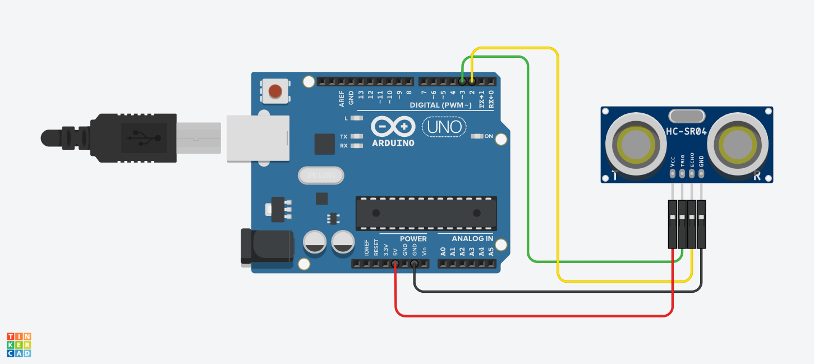

<h1>HC-SR04 Kullanımı</h1>

<strong>Projenin Amacı:</strong> 
Bu uygulamanın amacı, HC-SR04 ultrasonik mesafe sensörünün nasıl çalıştığını öğrenmek ve mesafe ölçümünü iki farklı yöntemle gerçekleştirmektir.

Mesafe ölçümü şu şekilde yapılır:

<pre>
Mesafe = (Süre x Ses Hızı) / 2
</pre>

Ses hızı havada yaklaşık olarak 343 m/s’dir. Bu, şu şekilde farklı birimlerde ifade edilebilir:

<ul>
  <li>343 m/s = 34.300 cm/s</li>
  <li>= 0.0343 cm/μs</li>
</ul>

Bu bilgiler ışığında mesafe şu formüllerle hesaplanabilir:

<ul>
  <li>Mesafe(cm) = Zaman(μs) * 0.01715</li>
  <li>Mesafe(cm) = Zaman(μs) / 58.2</li>
  <li>Mesafe(cm) = (Zaman(μs) / 2) / 29.1</li>
  <li>Mesafe(cm) = Zaman(μs) * 0.0343 / 2</li>
</ul>

Bu ölçümü iki farklı yöntemle gerçekleştirebiliriz:

<ul>
  <li><strong>1. pulseIn() yöntemi:</strong> Trigger pini ile sinyal gönderilip echo pininden gelen sinyalin süresi ölçülür. Ardından yukarıdaki formüllerden biriyle mesafe hesaplanır.</li>
  <li><strong>2. NewPing kütüphanesi:</strong> Bu kütüphane HC-SR04 sensörünü daha hızlı ve kararlı biçimde kullanmamıza olanak tanır. Mesafeyi doğrudan <code>ping_cm()</code> fonksiyonu ile hesaplar.</li>
</ul>

<h3>pulseIn() ve NewPing Karşılaştırması</h3>
<table border="1" cellpadding="6">
  <thead>
    <tr>
      <th>Yöntem</th>
      <th>Avantajlar</th>
      <th>Dezavantajlar</th>
    </tr>
  </thead>
  <tbody>
    <tr>
      <td><strong>pulseIn()</strong></td>
      <td>
        - Kütüphane gerekmez 
        - Temel düzeyde öğrenim için uygundur 
        - Kod yapısı nettir
      </td>
      <td>
        - Bloklayıcıdır (programı durdurur) 
        - Gürültüye karşı hassastır 
        - Daha yavaş çalışır
      </td>
    </tr>
    <tr>
      <td><strong>NewPing</strong></td>
      <td>
        - Daha hızlı çalışır 
        - Bloklamasız modları vardır (ping_timer) 
        - Gürültü filtreleme (ping_median) sağlar
      </td>
      <td>
        - Ekstra kütüphane yüklenmesi gerekir 
        - Başlangıç seviyesi için fazla soyut olabilir
      </td>
    </tr>
  </tbody>
</table>

<h2> Kullanılan Bileşenler</h2>
<ul>
  <li>1 x Arduino UNO </li>
  <li>1 x Ultrasonik Mesafe Ölçer(HC-SR04)</li>
  <li>Jumper kabloları</li>
  <li>Breadboard (devreyi kurmak için)</li>
</ul>

<h2>Devre Simülasyon Linki</h2>

https://www.tinkercad.com/things/lluwgA0wFFm-hc-sr04?sharecode=GZbBQW1RaOWto74Ij2R7vtXimAdubqkYuvxRHrqbqXs

<h3>Devre Şeması</h3>

Şekil 1: <em>Devre şeması</em>

