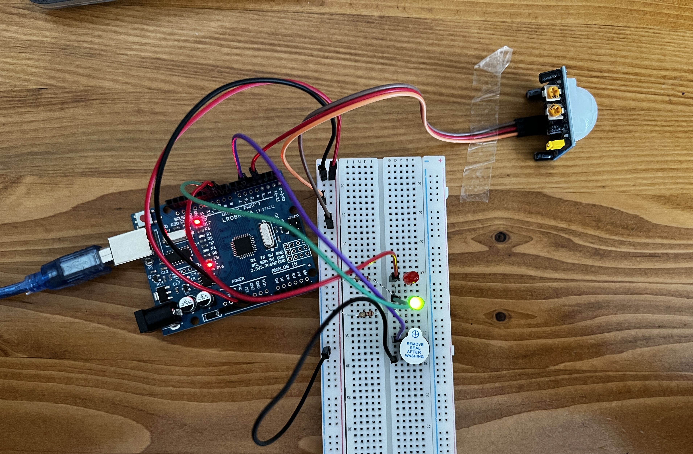

<h1>Radar Uygulaması</h1>

<strong>Projenin Amacı:</strong> 
Günümüzde birçok kurumda ve apartmanda kullanılan PIR (hareket) sensörleri, hareket algıladıklarında bağlı bulundukları mekanizmadaki ışığı otomatik olarak yakmaktadır. Evlerde kullanılan güvenlik sistemlerinde ise bu sensörler, hareket algıladıklarında alarm sistemini devreye sokarak ev sahibini uyarırlar.

Biz de bugün, benzer mantıkla çalışan basit bir güvenlik düzeneği oluşturacağız. PIR sensörü bir hareket algıladığında, kırmızı LED yanacak ve sesli uyarı verecektir. Herhangi bir hareket algılanmadığında ise yeşil LED yanacaktır.

İsteğe bağlı olarak, sensör üzerindeki potansiyometreler yardımıyla hareket algılama mesafesini ve LED’lerin yanma süresini ayarlayabiliriz. Ayrıca, üzerindeki jumper anahtarıyla tetikleme (tek seferlik ya da sürekli) modunu değiştirmek de mümkündür.

<h2> Kullanılan Bileşenler</h2>
<ul>
  <li>1 x Arduino UNO </li>
  <li>1 x Hareket Sensörü(PIR)</li>
  <li>2 x 220Ω Direnç </li>
  <li>2 x LED(Kırmızı ve Yeşil)</li>
  <li>1 x Aktif Buzzer</li>
  <li>Jumper kabloları</li>
  <li>Breadboard (devreyi kurmak için)</li>
</ul>
<h2>Simülasyon Linki</h2>

https://www.tinkercad.com/things/dJQVG7cXWcH-hirsiz-uyari-uygulamasi?sharecode=WvNwDkSXDZKucuoYVPKqlSbp8TwxlhzU8u-zpBytVyY

<h3>Devre Şeması</h3>

