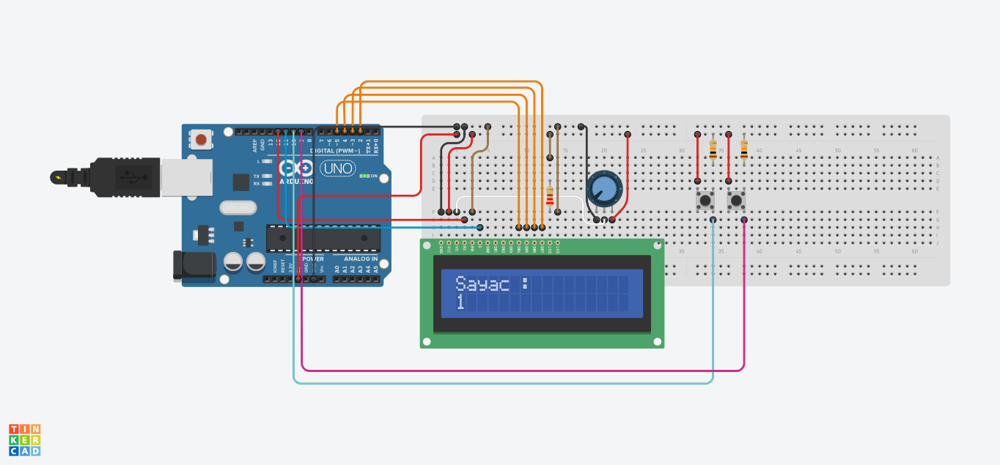
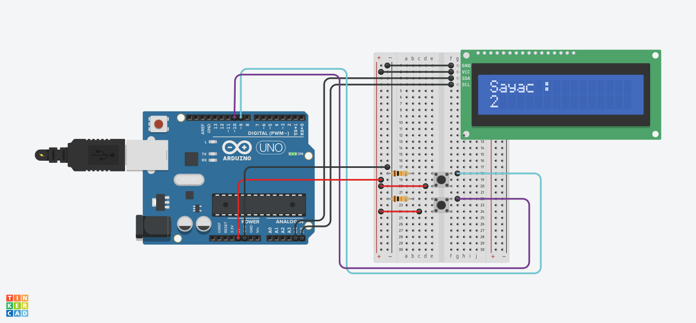

<h1>LCD ile Sayaç Yapma</h1>

<blockquote style="background-color: #f9f9f9; border-left: 5px solid #ccc; padding: 10px;">
  <strong> Proje Açıklaması:</strong> 
  Bu projede, iki adet buton ile bir sayaç sistemi oluşturulmuştur.  
  <strong>🔼 Arttırma</strong> butonuna basıldığında sayaç bir artar.  
  <strong>🔽 Azaltma</strong> butonuna basıldığında sayaç bir azalır.  
  Sayı, anlık olarak LCD ekran üzerinde görüntülenir.
</blockquote>

<h2>Donanım Bileşenleri</h2>
<ul>
  <li>1 x Arduino UNO</li>
  <li>1 x 10kΩ potansiyometre (LCD kontrast ayarı için)</li>
  <li>1 x 220Ω direnç (LCD arka ışık için)</li>
  <li>2 x 10kΩ direnç (butonlar için pull-down)</li>
  <li>2 x Basmalı Buton (bir arttırma, bir azaltma için)</li>
  <li>1 x LCD Ekran (Paralel veya I2C modülü ile)</li>
  <li>Jumper kablolar</li>
  <li>Breadboard</li>
</ul>

<h3>Devre Fotoğrafları</h3>

<em>Şekil 1: Standart Paralel LCD Bağlantısı ile Sayaç</em>

<em>Şekil 2: I2C Modüllü LCD Bağlantısı ile Sayaç</em>

