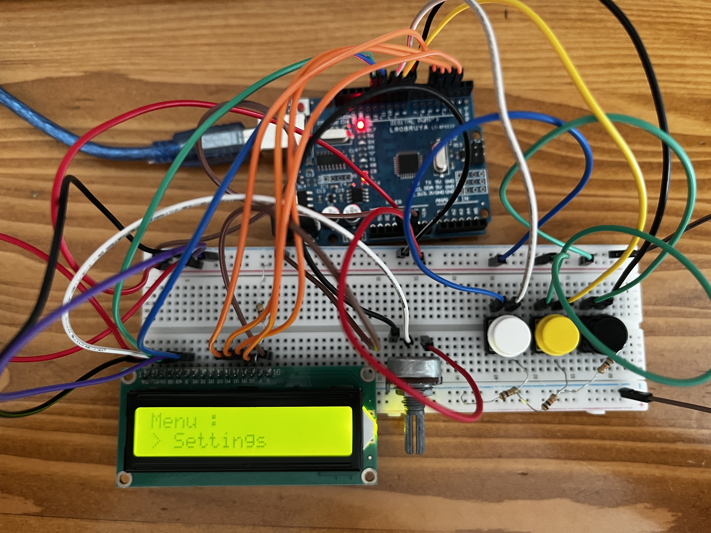

<h1>Butonlarla LCD Menü Yapma</h1>

  Bu projede, LCD ekran üzerinde menü kontrolü sağlamak amacıyla <strong>üç buton</strong> kullanılmıştır:

<ul>
  <li><strong>Up (Yukarı):</strong> Menüde bir üst seçeneğe geçmek için</li>
  <li><strong>Down (Aşağı):</strong> Menüde bir alt seçeneğe geçmek için</li>
  <li><strong>Select (Seç):</strong> Mevcut seçeneği onaylamak/göstermek için</li>
</ul>

  Kullanıcı bu butonlarla <em>Settings</em>, <em>About</em>, <em>Time</em> ve <em>Exit</em> gibi menü seçenekleri arasında gezinip seçim yapabilir. Seçilen menü LCD ekranda ilgili bilgiyle birlikte gösterilir.

<h2>Donanım Bileşenleri</h2>
<ul>
  <li>1 x Arduino UNO</li>
  <li>1 x 10kΩ potansiyometre (LCD kontrast ayarı için)</li>
  <li>1 x 220Ω direnç (LCD arka ışık için)</li>
  <li>3 x 10kΩ direnç (butonlar için pull-down bağlantısı)</li>
  <li>3 x Basmalı Buton (yukarı, aşağı ve seçim işlevleri için)</li>
  <li>1 x LCD 16x2 ekran (Paralel bağlantı veya I2C modülü ile)</li>
  <li>Jumper kablolar</li>
  <li>Breadboard</li>
</ul>

<h2>Devre Görselleri</h2>

<em>Şekil 1: <strong>Settings</strong> ekranı</em>

<em>Şekil 2: <strong>About</strong> ekranı</em>

<em>Şekil 3: <strong>Time</strong> ekranı</em>

<em>Şekil 4: <strong>Exit</strong> ekranı</em>

