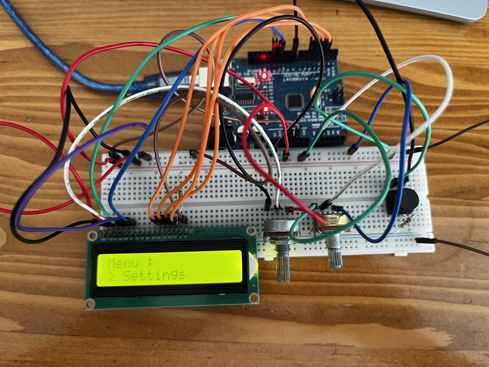
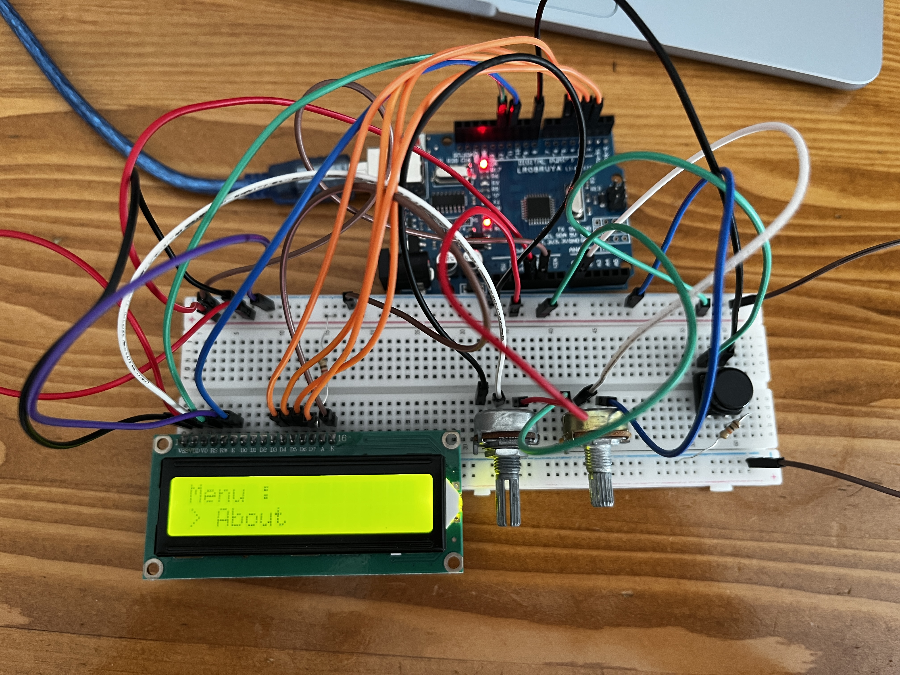
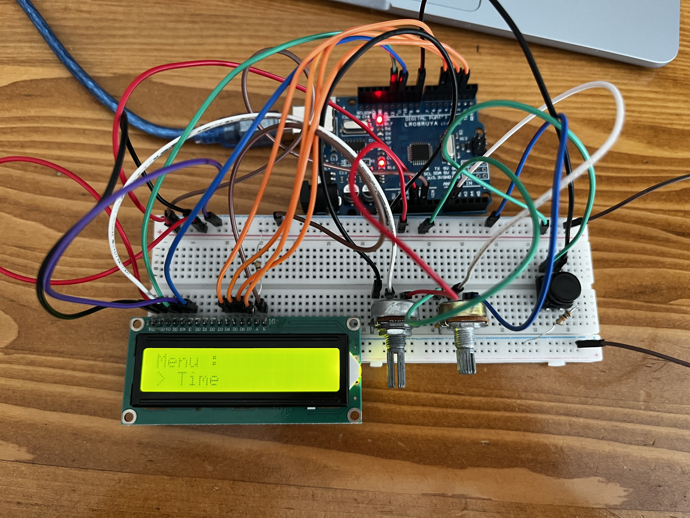
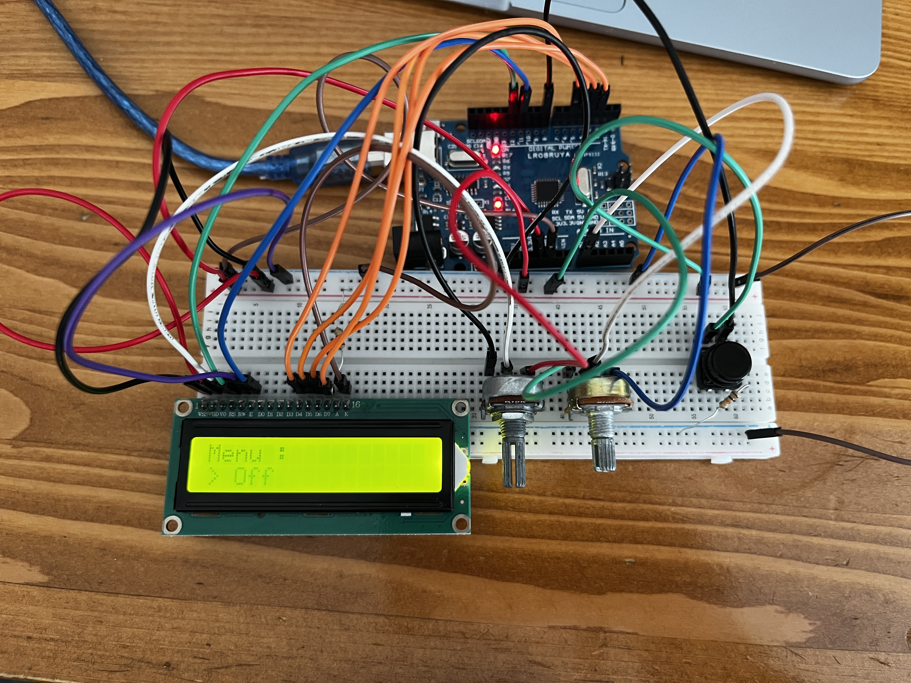

<h1>Potansiyometre ile LCD Menü Yapma</h1>

  Bu projede, LCD ekran üzerinde menü kontrolü sağlamak amacıyla <strong>bir potansiyometre</strong> ve <strong>bir seçim butonu</strong> kullanılmıştır:

<ul>
  <li><strong>Potansiyometre:</strong> Menüde yukarı/aşağı gezinmeyi sağlar</li>
  <li><strong>Select (Seç) Butonu:</strong> Seçili menü öğesini onaylar ve gösterir</li>
</ul>

  Kullanıcı, potansiyometreyi çevirerek <em>Settings</em>, <em>About</em>, <em>Time</em> ve <em>Exit</em> gibi menü seçenekleri arasında gezebilir. Seçim butonuna bastığında ilgili içerik LCD ekranda gösterilir.

<h2>Donanım Bileşenleri</h2>
<ul>
  <li>1 x Arduino UNO</li>
  <li>1 x 10kΩ potansiyometre (menü kontrolü için)</li>
  <li>1 x 10kΩ potansiyometre (LCD kontrast ayarı için, isteğe bağlı)</li>
  <li>1 x 220Ω direnç (LCD arka ışık için)</li>
  <li>1 x 10kΩ direnç (seçim butonu için pull-down bağlantısı)</li>
  <li>1 x Basmalı Buton (seçim işlemi için)</li>
  <li>1 x LCD 16x2 ekran (Paralel bağlantı veya I2C modülü ile)</li>
  <li>Jumper kablolar</li>
  <li>Breadboard</li>
</ul>

<h2>Devre Görselleri</h2>

<em>Şekil 1: <strong>Settings</strong> ekranı</em>

<em>Şekil 2: <strong>About</strong> ekranı</em>

<em>Şekil 3: <strong>Time</strong> ekranı</em>

<em>Şekil 4: <strong>Exit</strong> ekranı</em>

