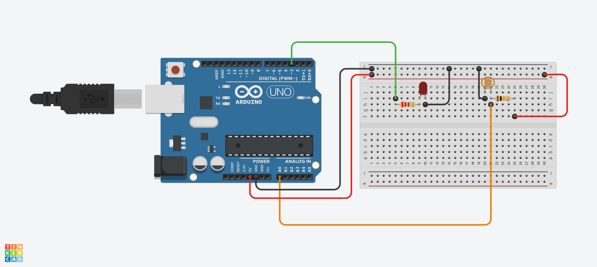

<h1>LDR ile LED Uygulamaları</h1>

<strong>Projelerin Açıklaması:</strong> 
Bu uygulamanın amacı, LDR ile ışık şiddeti ve direnç arasındaki bağlantıyı bilmek ve bunu LED ile uygulamaktır

Projemizde iki farklı senaryoyu ele alacağız:

<strong>1. LDR ile LED Yakma </strong>

Burada LDR'nin ışık şiddetine göre direnç değerini değiştirmesi ve bu direnç değerine göre Arduino'da belli aralıklarda LED'i yakıp
söndürmektir. Uygulama 500 ve 500'den küçük olduğunda yanmayan ama 500'den büyük olduğunda yanandır.

<strong>2. LDR ile LED Parlaklığını Ayarlama</strong>

Burada ise LDR'nin ışık şiddetinden ötürü aldığı direnç değerini PWM'e göre(0-255) ayarlayıp sonrasında bu parlaklık değerini LED'e
<code>analogRead()</code> ile göndermektir.Bu sayede LED parlaklığını ışık şiddetine göre ayarlayabiliriz

<h2> Kullanılan Bileşenler</h2>
<ul>
  <li>1 x Arduino UNO </li>
  <li>1 x Fotodirenç(LDR)</li>
  <li>1 x LED</li>
  <li>1 x 220Ω direnç (LED için)</li>
  <li>1 x 10kΩ direnç (Pull-down LDR için)</li>
  <li>Jumper kabloları</li>
  <li>Breadboard (devreyi kurmak için)</li>
</ul>

<h2>Devre Simülasyon Linki</h2>

1. için https://www.tinkercad.com/things/aQIbKT2m7kK-ldrled?sharecode=xDlb9tes2JtNJSYDAJcaYPstalP9vruiZkzyB475Ze8

2. için https://www.tinkercad.com/things/8LcuCOb17hQ-ldrparlaklik?sharecode=ss58-IC3nTk0Ms0dWmcNoT8JLUGku1M7u3SZDYBtxDo

<h3>Devre Şeması</h3>

Şekil 1: <em>Devre şeması</em>

