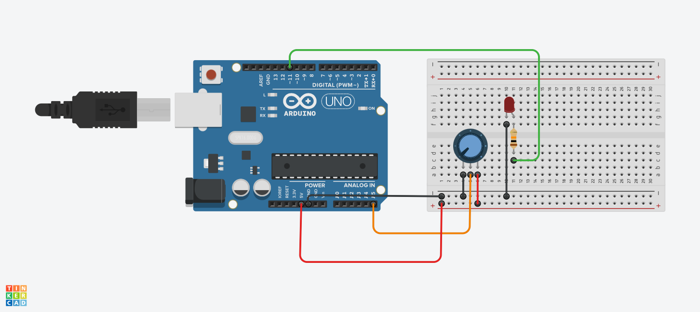

<h1>Potansiyometre ile Parlaklık Ayarlama</h1>

<strong>Proje Açıklaması:</strong> 
Bu projede bir potansiyometre kullanarak LED'in parlaklığı manuel olarak ayarlanabilmektedir. Potansiyometreden okunan analog değer, Arduino'nun PWM çıkışına dönüştürülerek LED'in parlaklığını kontrol eder.

<h2>Malzemeler</h2>

- Arduino UNO
- 1 adet LED  
- 1 adet 1kΩ direnç
- 10 kΩ potansiyometre
- Jumper kablolar  
- Breadboard  

<h2>Devre Simülasyon Linki</h2>

https://www.tinkercad.com/things/bMcmtQJsuUb-potansiyoled?sharecode=hlGu-a8HeB3VcLhLs23wfoIgWij-3XfERPu0vNU34ao

<h3>Devre Şeması ve Düzeneği</h3>

Şekil 1: <em>Devre şeması</em>

