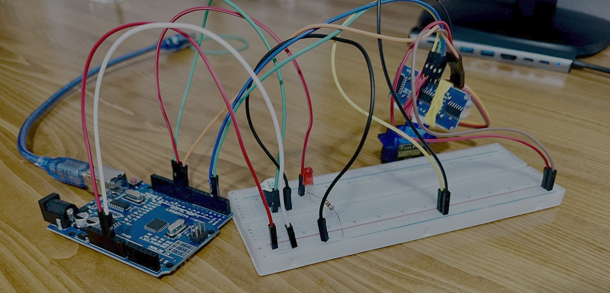
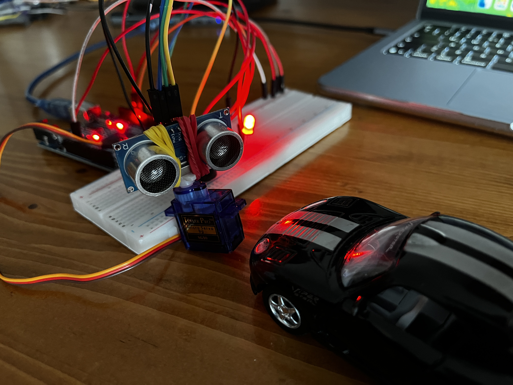

<h1>Radar Uygulaması</h1>

<strong>Projenin Amacı:</strong> 
Günümüzde savunma sanayisinde ve birçok farklı alanda kullanılan radar teknolojisini, 
Arduino platformu ve temel bileşenlerle uygulamalı olarak gerçekleştirdim. Bu projede, servo motor ve HC-SR04 ultrasonik mesafe sensörü kullanarak, 
180° dönebilen bir radar sistemi tasarladım. Sistem, çevresindeki nesneleri algılayarak mesafelerini ölçer 
ve belirli bir eşik değerinin altına düştüğünde LED yanar ve aktif buzzer ses çıkarır.

<h2> Kullanılan Bileşenler</h2>
<ul>
  <li>1 x Arduino UNO </li>
  <li>1 x Ultrasonik Mesafe Ölçer(HC-SR04)</li>
  <li>1 x 220Ω Direnç </li>
  <li>1 x LED</li>
  <li>1 x Aktif Buzzer</li>
  <li>1 x Servo Motor(SG90)</li>
  <li>Jumper kabloları</li>
  <li>Paket lastiği(Ben bu şekilde yaptım ama aparatları vardır)</li>
  <li>Breadboard (devreyi kurmak için)</li>
</ul>

<h3>Devre Şeması</h3>

