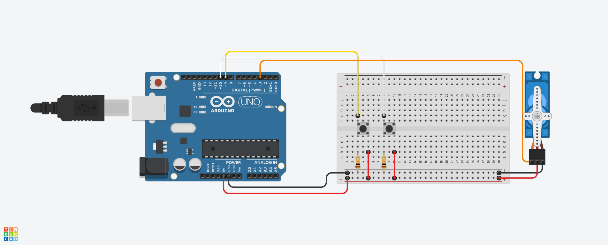

<h1>Servo Motoru Potansiyometre ile Kontrol Etme</h1>

<strong>Proje Açıklaması:</strong> 
Bu uygulamada ise iki buton kullandık.
Bu butonlardan biri azaltma biri arttırma şeklindedir.
Arttıran buton 5º arttırırken
Azaltan buton ise 5º azaltır
Burada en önemli nokta 0º ile 180º aralığında tutmamızdır ondan dolayı azaltma ve arttırmaya gerekli karar komutlarını koyarak servo motorun derece aralığı dışına çıkmadık

  
<h2> Kullanılan Bileşenler</h2>
<ul>
  <li>1 x Arduino UNO </li>
  <li>1 x Pil(AAA)(İsteğe bağlı)</li>
  <li>1 x Servo Motor</li>
  <li>2 x Basmalı Buton</li>
  <li>2 x 10 kΩ direnç</li>
  <li>Jumper kabloları</li>
  <li>Breadboard (devreyi kurmak için)</li>
</ul>
<h2>Devre Simülasyon Linki</h2>

https://www.tinkercad.com/things/aoSXIpfahdM-buttonservo?sharecode=zBe7QvkMIVV66RqbRkLUV81tZQP2QxVPzBqQsjxgRrM

<h3>Devre Şeması</h3>

