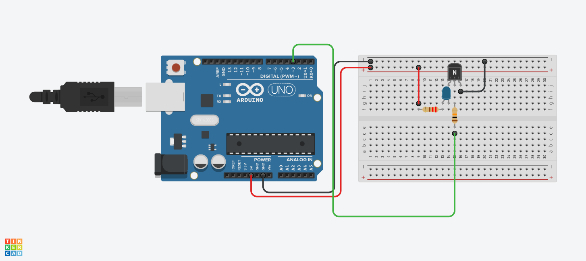
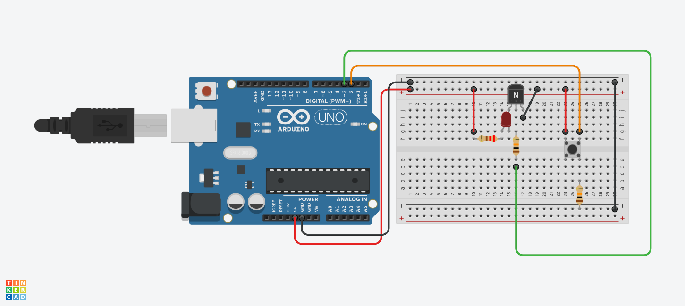

<h1>Transistör ile LED Yakma</h1>

<strong>Projelerin Açıklaması:</strong> 
Bu uygulamanın amacı, transistörün nasıl bir anahtar gibi kullanılabileceğini göstermek ve “transistör nedir, ne değildir?” sorusuna temel düzeyde cevap vermektir.

Projemizde iki farklı senaryoyu ele alacağız:

<strong>1. Arduino ile Transistörle LED Yakma (Butonsuz)</strong>

Bu devrede buton kullanmadan, doğrudan Arduino’nun dijital çıkış piniyle transistör kontrol edilerek LED yakılır.
NPN tipi transistör bir “elektronik anahtar” gibi kullanılır. Arduino pininden base bacağına sinyal gönderildiğinde transistör iletime geçer ve LED yanar.

<strong>2. Buton ile Transistörle LED Yakma (Manuel Kontrol)</strong>

Bu devrede LED’in doğrudan butonla değil, buton üzerinden transistörün base’i tetiklenerek yakılması sağlanır.
Amaç: Yüksek akımı doğrudan butona vermek yerine, sadece transistörün base’ine sinyal göndererek güvenli ve kararlı bir kontrol sağlamaktır.
Bu sistemde, buton sadece tetikleyicidir, gerçek anahtarlama görevini transistör yapar.

<strong>Peki Neden Sadece Buton Değil de Transistör?</strong>

	Evet, sadece buton kullanarak da bir LED yakılabilir.
Ancak bu, küçük yükler için geçerlidir. 
Daha büyük akım çeken motor, LED şerit, röle gibi yüklerde buton zarar görebilir.	
Transistör, hem yüksek akım taşıyabilir hem de Arduino gibi dijital sistemlerle kontrol edilebilir.
Aynı zamanda bir Arduino pini ve buton birlikte kullanılarak manuel ve otomatik kontrol birleştirilebilir.

<h2> Kullanılan Bileşenler</h2>
<ul>
  <li>1 x Arduino UNO </li>
  <li>1 x NPN Transistör (örneğin 2N2222 veya BC547)</li>
  <li>1 x LED</li>
  <li>1 x 220Ω direnç (LED için)</li>
  <li>1 x 1kΩ direnç (Transistör base’i için)</li>
  <li>1 x 10kΩ direnç (Pull-down direnci, butonlu versiyon için)</li>
  <li>1 x Basmalı Buton (manuel versiyon için)</li>
  <li>Jumper kabloları</li>
  <li>Breadboard (devreyi kurmak için)</li>
</ul>

<h2>Devre Simülasyon Linki</h2>

1. için https://www.tinkercad.com/things/k4d1zCwEthn-transisled?sharecode=8UVlHYR4teROlXF-QL3JrEjb_HC6eYLD0wa2YZ-nI6I

2. için https://www.tinkercad.com/things/gqKdEPubigo-transisbutled?sharecode=Ccz-QxNoM8Uhkn7lVlp_91bk2wjy2HcGwdtfBX17bEg

<h3>Devre Şeması</h3>

