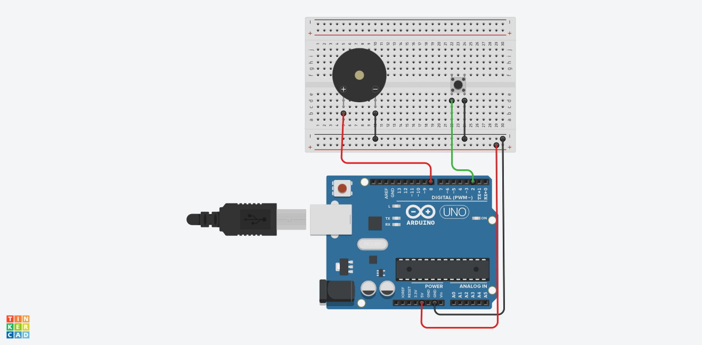

<h1>Aktif Buzzer</h1>

<strong>Proje Açıklaması:</strong> 
Bu uygulamada Aktif Buzzer/Pizeo kullanılmıştır. İki bacağı vardır ve bu bacakalrdan biri artı biri eksidir. Bu buzzer'ın artı olan bacağına
5 Volt, öbür bacağına ise GND bağlanırsa ses çıkarır ya da aynı butonla basıp çalıştırmak istiyorsak aynı LED gibi çalışır.

<h2> Kullanılan Bileşenler</h2>
<ul>
  <li>1 x Arduino UNO </li>
  <li>1 x Aktif Pizeo/Buzzer </li>
  <li>1 x Buton </li>
  <li>Jumper kabloları</li>
  <li>Breadboard (devreyi kurmak için)</li>
</ul>
<h2>Devre Simülasyon Linki</h2>

https://www.tinkercad.com/things/39BEm8GlqYA-aktifbuzzer?sharecode=4A1_Y1VkH3LJgPwgc0TYYxlh7R2Zfx0oFW5zUTMZjGc/p>
<h3>Devre Şeması</h3>

