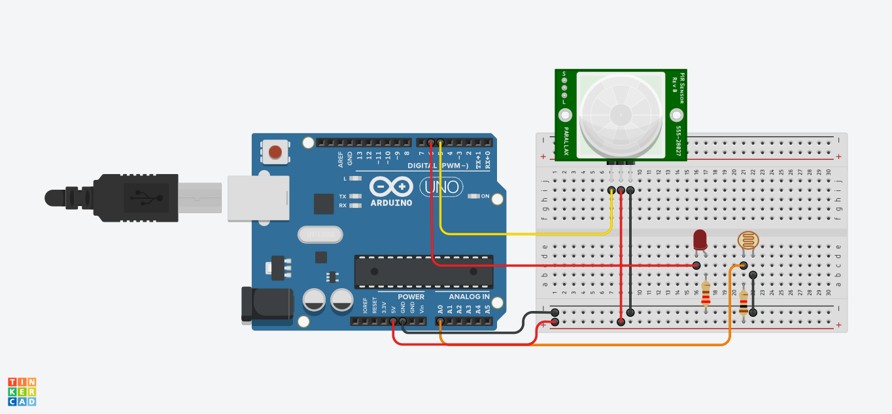

<h1>PIR ve LDR ile Gece/Bahçe Lambası</h1>

<strong>Projenin Amacı:</strong> 

Bu projede, bir <strong>PIR hareket sensörü</strong> ve bir <strong>LDR (ışığa duyarlı direnç)</strong> kullanarak, ortam ışığına bağlı olarak yalnızca karanlıkta çalışan bir <strong>akıllı lamba sistemi</strong> tasarlanmıştır. Bu sistem, özellikle bahçeler, koridorlar veya gece aydınlatmasının gerektiği dış ortamlar için idealdir.

<strong>LDR</strong>, ortamın karanlık olup olmadığını algılar. Eğer ortam yeterince karanlıksa ve <strong>PIR sensörü</strong> bir hareket algılarsa, sistem bağlı olan <strong>LED lambayı</strong> yakar. Böylece gündüz vakti enerji harcanmazken, gece birisi geçtiğinde otomatik olarak aydınlatma sağlanmış olur. LED, bir lamba görevi görerek geçici bir aydınlatma sunar.

<h2> Kullanılan Bileşenler</h2>
<ul>
  <li>1 x Arduino UNO </li>
  <li>1 x Hareket Sensörü(PIR)</li>
  <li>1 x 220Ω Direnç </li>
  <li>1 x 10kΩ Direnç</li>
  <li>1 x LED</li>
  <li>1 x Fotorezistör(LDR)</li>
  <li>Jumper kabloları</li>
  <li>Breadboard (devreyi kurmak için)</li>
</ul>
<h2>Simülasyon Linki</h2>

https://www.tinkercad.com/things/8tHsl5fzVf0-gecelambasi?sharecode=uiu73rBgF3ahTP0R_l1SJaFIIDBeQciQenWwPneKJec

<h3>Devre Şeması</h3>

