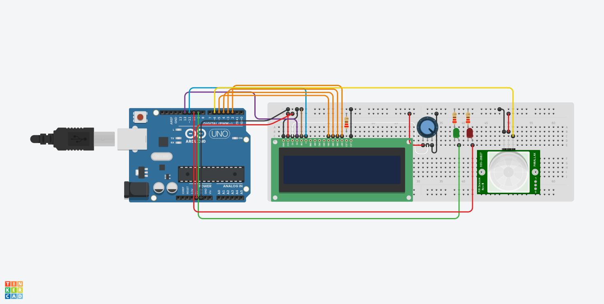
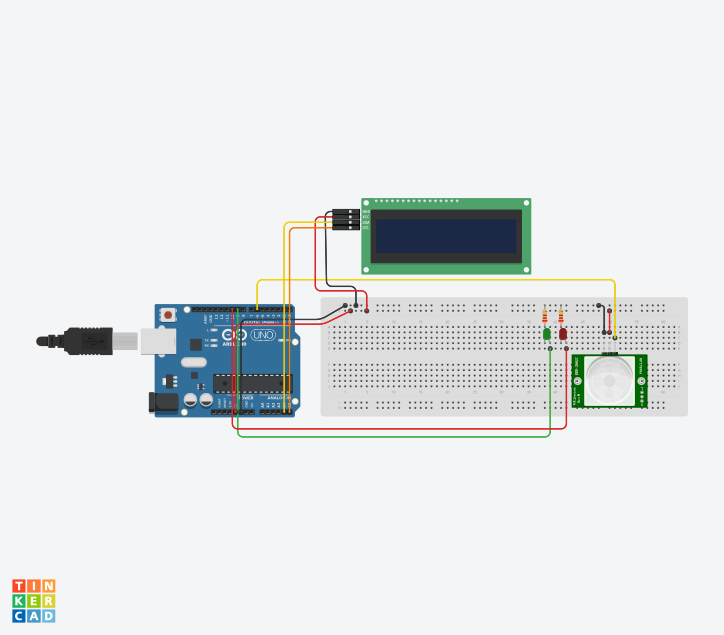
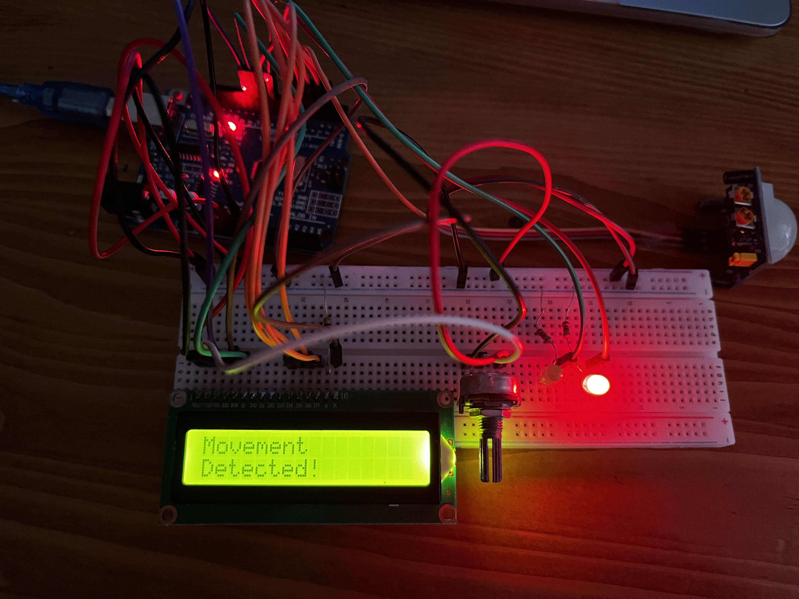
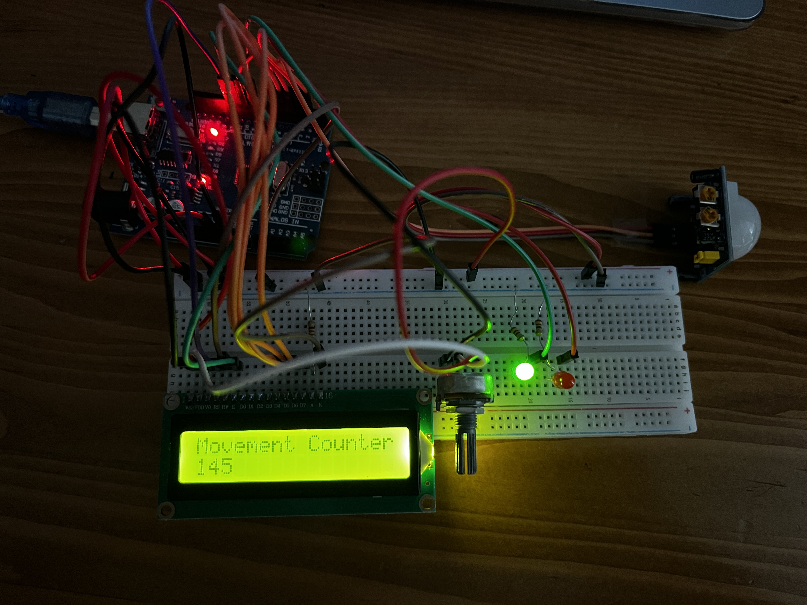

<h1>LCD ve PIR ile Hareket Sayacı Yapma</h1>

<blockquote style="background-color: #f9f9f9; border-left: 5px solid #ccc; padding: 10px;">
  <strong> Proje Açıklaması:</strong> 
  Bu projede iki durum vardır:  
  <strong>🚨 Hareket VAR/strong> PIR sensörüyle hareket olduğu algılandıktan sonra kırmızı LED yanar ve hareket olduğunu ekranda yazar.  
  <strong>✅ Hareket YOK</strong> PIR sensörü hareket algılamadığında yeşil LED yanar ve ekranda toplam hareket sayısını gösterir  
  Bu sayı her hareket olduğunda hareket sayısını bir arttırır. 
</blockquote>

<h2>Donanım Bileşenleri</h2>
<ul>
  <li>1 x Arduino UNO</li>
  <li>1 x 10kΩ potansiyometre (LCD kontrast ayarı için)</li>
  <li>3 x 220Ω direnç (LCD arka ışık ve LED'ler için)</li>
  <li>2 x LED (biri kırmızı, bir yeşil)</li>
  <li>1 x LCD Ekran (Paralel veya I2C modülü ile)</li>
  <li>1 x Hareket Sensörü(PIR)</li>
  <li>Jumper kablolar</li>
  <li>Breadboard</li>
</ul>

<h3>Devre Fotoğrafları</h3>

<em>Şekil 1: Standart Paralel LCD Bağlantısı ile Sayaç</em>

<em>Şekil 2: I2C Modüllü LCD Bağlantısı ile Sayaç</em>

<em>Şekil 3: Hareket Varken</em>

<em>Şekil 4: Hareket Yokken</em>

