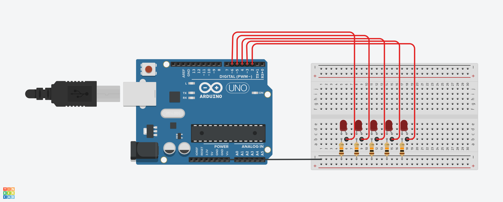
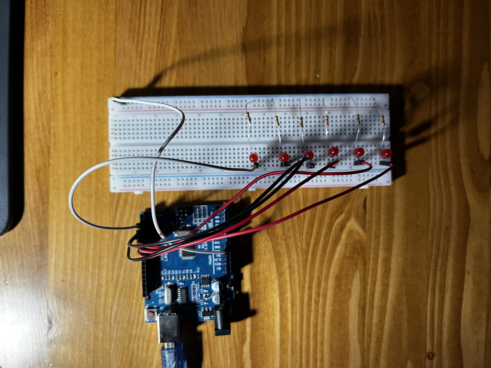

<h1>Kara Şimşek Led Uygulaması</h1>

Bu proje, Arduino ile bir dizi LED’in hızlı ve ardışık olarak yanıp sönmesiyle gerçek bir “kara şimşek” (thunderbolt) efekti yaratmayı amaçlamaktadır.  
Zamanlayıcı ve döngü kontrolü kullanarak ışık efektleri oluşturmayı öğrenmek için idealdir.

<h2>Proje Açıklaması</h2>

- Arduino UNO
- 6 adet LED  
- 6 adet 1kΩ direnç  
- Jumper kablolar  
- Breadboard  

<h3>Devre Şeması ve Düzeneği</h3>

