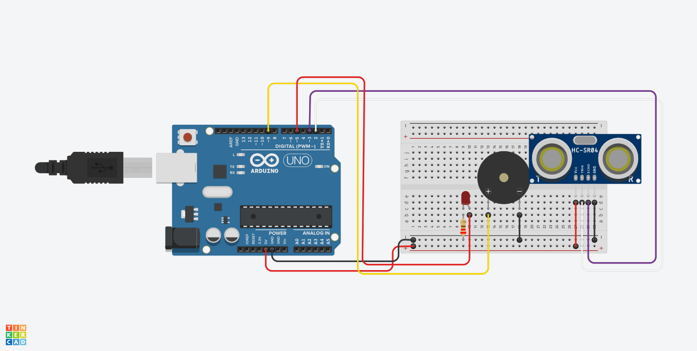
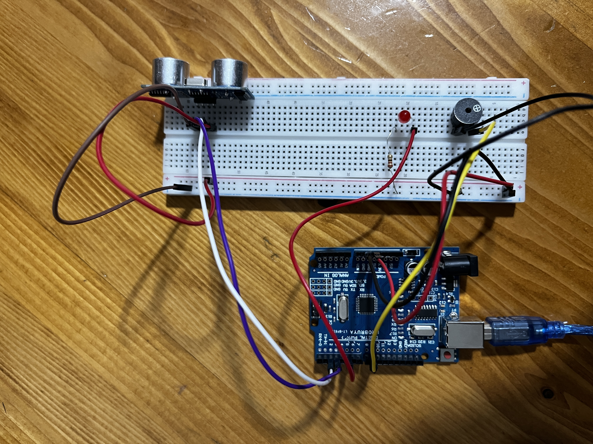

<h1>Park Sensörü</h1>

<strong>Projenin Amacı:</strong> 
Bu uygulamanın amacı, HC-SR04 ultrasonik mesafe sensörü kullanarak otomotiv sektöründe yaygın olan park sensörü sistemini gerçekleştirmektir. Sensörün ölçtüğü mesafeye bağlı olarak bağlı LED ve buzzer devreye girer ve bu bileşenlerin verdikleri tepkiler sayesinde mesafe hakkında bilgi edinilir. Böylece, araç park ederken mesafeyi kolayca takip etmek mümkün olur.

<h2> Kullanılan Bileşenler</h2>
<ul>
  <li>1 x Arduino UNO </li>
  <li>1 x Ultrasonik Mesafe Ölçer(HC-SR04)</li>
  <li>1 x 220Ω Direnç </li>
  <li>1 x LED</li>
  <li>1 x Buzzer(Pasif olması daha iyi) </li>
  <li>Jumper kabloları</li>
  <li>Breadboard (devreyi kurmak için)</li>
</ul>

<h2>Devre Simülasyon Linki</h2>

https://www.tinkercad.com/things/jqhXMdXoAgE-parksensoru?sharecode=IbtyXrFlKZfp_NwU7pqverbUAmSqu8j4F22glkd_OrE

<h3>Devre Şeması</h3>

