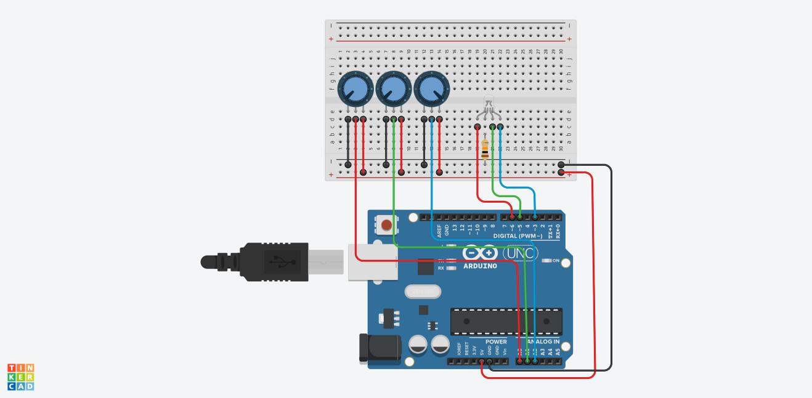

<h1>Potansiyometre ile RGB LED Rengi Ayarlama</h1>

<strong>Proje Açıklaması:</strong> 
Bu uygulama ile potansiyometrelerden aldığımız analog sinyal değerlerini PWM kullanarak 0-255 aralığında dönüştürüp her bir RGB rengini ayrı ayrı kontrol edebiliriz. Kullandığımız RGB LED ortak anot veya ortak katot olabilir, bu devrede ortak katot kullanılmıştır. Ortak anotta direnç sayısımız artar.

<h2> Kullanılan Bileşenler</h2>
<ul>
  <li>1 x Arduino UNO </li>
  <li>1-3 x 10kΩ direnç </li>
  <li>3 x Potansiyometre </li>
  <li>1 x RGB LED</li>
  <li>Jumper kabloları</li>
  <li>Breadboard (devreyi kurmak için)</li>
</ul>
<h2>Devre Simülasyon Linki</h2>

https://www.tinkercad.com/things/71YNFAFFuIy-potrgb?sharecode=K85Kdt3nDQAfgjW3EECGCHaEraa9VGKtmMY9oYqwBxA

<h3>Devre Şeması</h3>

