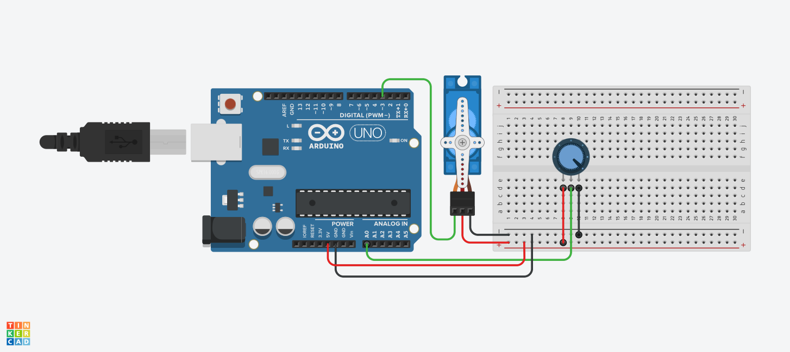

<h1>Servo Motoru Potansiyometre ile Kontrol Etme</h1>

<strong>Proje Açıklaması:</strong> 
Bu uygulamada servo motoru ele aldık.
Servo motorun içinde dişliler, bir potansiyometre ve küçük bir DC motor bulunur. Bu mekanizmaya üç bağlantı yapılır:
Güç (VCC), topraklama (GND) ve sinyal. Güç kaynağı olarak ister pil, ister doğrudan Arduino kullanılabilir — her iki durumda da motor çalışır.

Sinyal pinini, Arduino’daki PWM destekli bir dijital pine bağladık. Kod kısmında ise <code>#include &lt;Servo.h&gt;</code> kütüphanesini ekleyerek bir Servo nesnesi (örneğin myServo) oluşturduk. Ardından:
	•	<code>attach()</code> fonksiyonu ile servo motoru belirli bir pine bağladık,
	•	<code>write()</code> ya da <code>writeMicroseconds()</code> fonksiyonu ile motorun döneceği açıyı belirledik.

Bu uygulamada ayrıca bir potansiyometreden okunan analog değeri, servo motorun açısını değiştirmek için nasıl kullandığımızı da öğrendik.
Yani potansiyometre → analog giriş → map() → servo kontrolü şeklinde bir dönüşüm gerçekleştirdik.

  
<h2> Kullanılan Bileşenler</h2>
<ul>
  <li>1 x Arduino UNO </li>
  <li>1 x Pil(AAA)(İsteğe bağlı)</li>
  <li>1 x Servo Motor</li>
  <li>1 x 10 kΩ potansiyometre</li>
  <li>Jumper kabloları</li>
  <li>Breadboard (devreyi kurmak için)</li>
</ul>
<h2>Devre Simülasyon Linki</h2>

https://www.tinkercad.com/things/el6ewreAzXq-servopot?sharecode=KbwwtqiClM3A451rj9yVv3OwmnefNVmLzGehG3lZZZc

<h3>Devre Şeması</h3>

