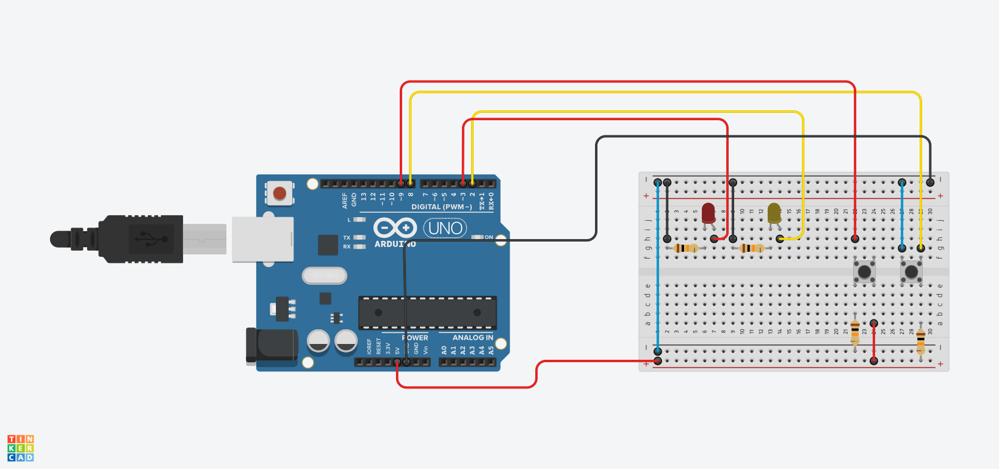
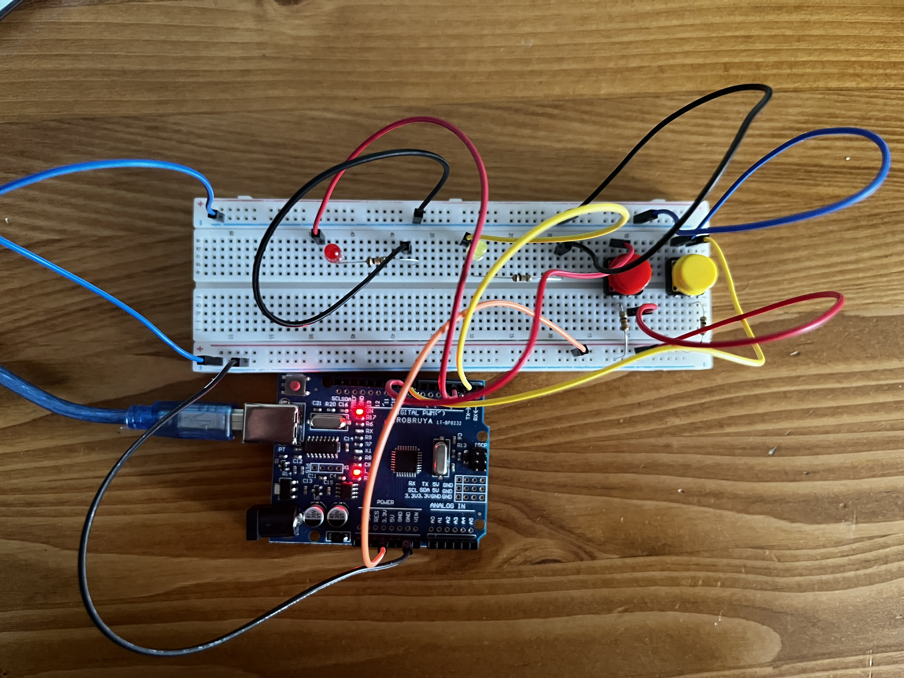

<h1>Arduino Pull-up ve Pull-down Buton Devresi</h1>

<strong>Proje Açıklaması:</strong> 
Bu proje, Arduino ile buton kullanımı ve dijital giriş pinlerinin doğru şekilde yapılandırılması konusunu ele almaktadır. Butonların doğru çalışabilmesi için kullanılan <strong>pull-up</strong> ve <strong>pull-down</strong> dirençlerinin nasıl bağlanacağı ve Arduino'nun dahili <code>INPUT_PULLUP</code> özelliğinin nasıl kullanılacağı gösterilmektedir. Bu sayede, butonların "floating" (yüzen) durumu engellenerek, daha güvenilir ve kararlı giriş sinyalleri elde edilir.

<h2> Kullanılan Bileşenler</h2>
<ul>
  <li>1 x Arduino UNO veya benzeri bir kart</li>
  <li>4 x 10kΩ direnç </li>
  <li>2 x Pushbutton (buton)</li>
  <li>2 x LED</li>
  <li>Jumper kabloları</li>
  <li>Breadboard (devreyi kurmak için)</li>
</ul>

<h2>Devre Şeması</h2>

